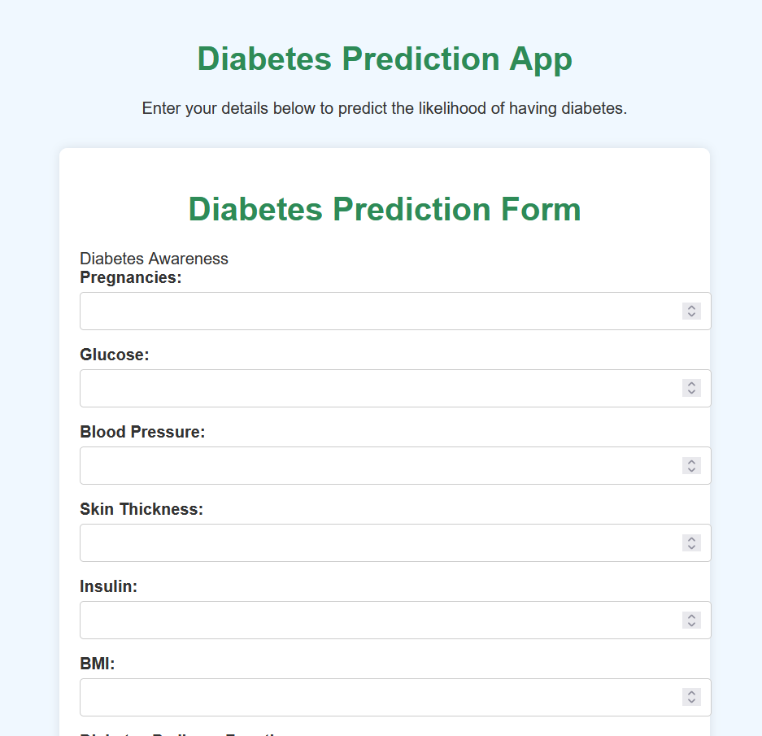

## Diabetes Prediction App

The **Diabetes Prediction App** is a user-friendly tool designed to help individuals assess their risk of developing diabetes. By entering key health metrics, users can receive predictions about their likelihood of having diabetes, powered by advanced machine learning algorithms.

### Features
- **Intuitive Interface**: Easy-to-use form for entering health details.
- **Personalized Predictions**: Based on user inputs, the app predicts diabetes risk using a trained machine learning model.
- **Comprehensive Metrics**:
  - **Pregnancies**: Number of pregnancies.
  - **Glucose Level**: Blood glucose level.
  - **Blood Pressure**: Systolic blood pressure (mm Hg).
  - **Skin Thickness**: Triceps skin fold thickness (mm).
  - **Insulin**: Insulin level (mu U/ml).
  - **BMI**: Body Mass Index.
  - **Diabetes Pedigree Function**: A function that scores the genetic predisposition to diabetes.
  - **Age**: Age of the individual.

### How It Works
Users simply need to fill out the form with the required information and click on the "Predict" button. The app processes the data using a trained machine learning model, which has been developed through extensive training on historical health data. This allows the app to provide an accurate assessment of diabetes risk, helping users make informed health decisions.

### Get Started
Visit the app: [Diabetes Prediction] to begin your assessment.

